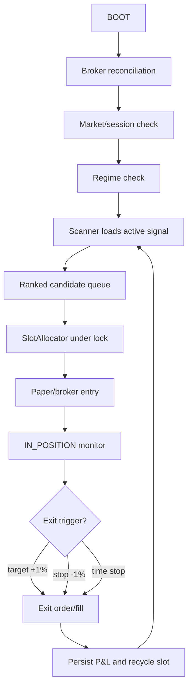

# DriftPilot Architecture

DriftPilot separates strategy research from execution safety. Signals can change; the operator, allocator, broker, storage, and dashboard contracts should remain stable.

## Runtime Flow



## State Ownership

- `driftpilot.clock`: all timezone-aware time logic.
- `driftpilot.storage`: SQLite schema and repository access.
- `driftpilot.state_machine`: legal operator states and transitions.
- `driftpilot.signals`: strategy/signal registry and candidate math.
- `driftpilot.execution`: allocator lock, slots, paper slippage, fills.
- `driftpilot.broker`: Alpaca paper/live integration and live gate.
- `driftpilot.backtest`: replay and report generation.
- `trading_bot.dashboard`: FastAPI shell and UI routes.

## Signal Boundary

Signals produce ranked candidates. They do not place trades, mutate positions, or bypass safety rules.

Required signal metadata:

```text
name
version
scan(symbol_bars, quotes, spy_bars, rvol_lookback) -> regime, candidates
```

The same signal registry is used by:

- live/paper scanner
- synthetic paper runtime
- backtest replay
- report metadata

## Persistence

SQLite is the source of truth for local operator state:

- operator state
- state transitions
- slots
- positions
- orders
- fills
- candidate queue
- recycle events
- stream state
- daily counters

Historical bars are cached as Parquet under `data/bars/databento/`.

## Live Gate

Live mode is a configuration state, not a separate code path. The same broker and operator code path is used, but order submission is blocked unless the live gate passes.

Required live gate:

- positive 12-month after-cost expectancy
- 60 positive paper-trading days with Sharpe > 1.0
- equity above PDT floor plus buffer
- explicit `LIVE_OK=true`

## Dashboard Contract

The UI is a read-only renderer of state for normal operation.

- Operator reads `/api/operator/state`.
- Admin reads `/api/admin/state` and exposes emergency overrides.
- Backtest reads `/api/backtest/report`.
- LLM settings are retained for future research workflows.

Normal entries and exits should not require manual confirmation.
