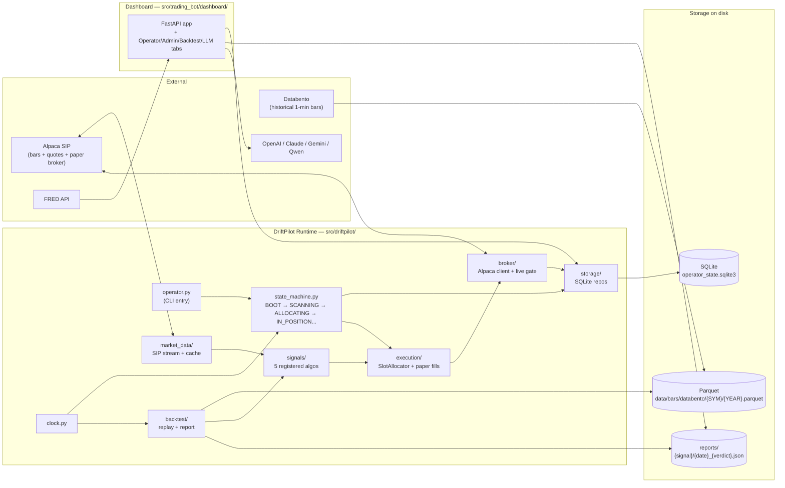
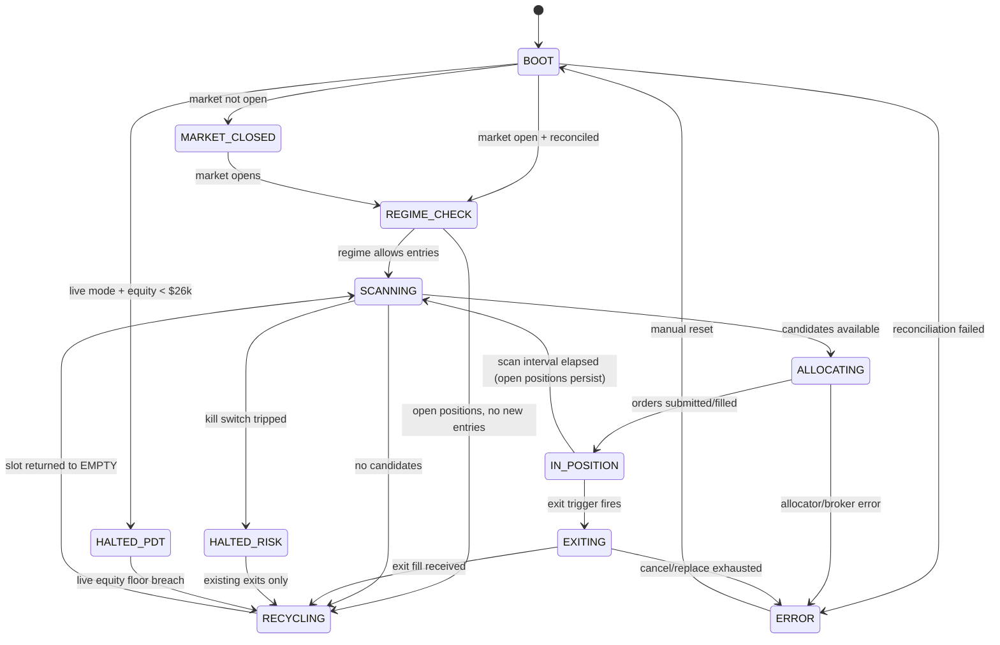
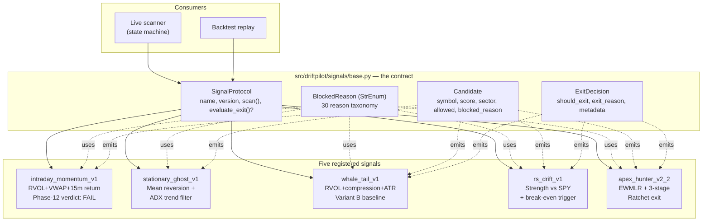
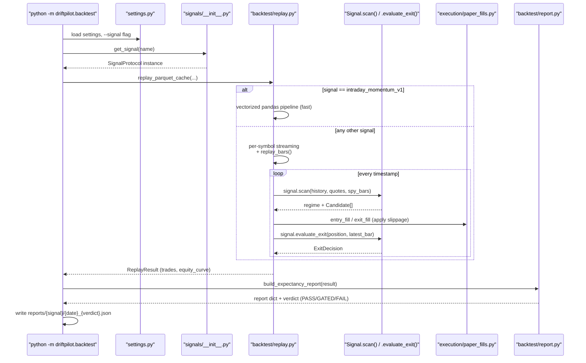
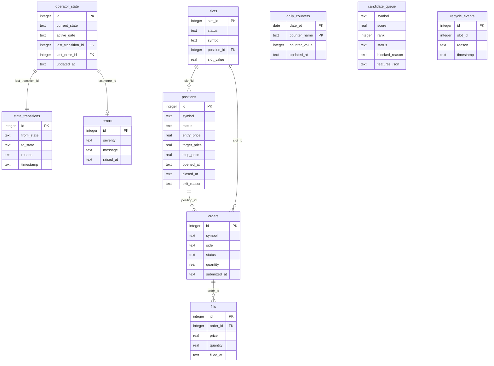
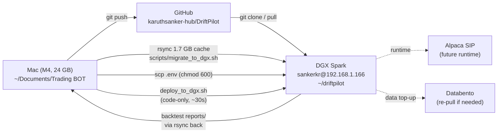

# DriftPilot — Project Overview

This is the single document that explains the whole project at a glance. Read this first when returning to the codebase. For deeper detail, follow links into [REFACTOR_PLAN.md](../REFACTOR_PLAN.md) (authoritative spec), [ARCHITECTURE.md](ARCHITECTURE.md) (runtime details), and per-signal `README.md` / `KNOWN_RISKS.md` files.

## What DriftPilot Is

A **continuous autonomous intraday paper-trading operator**. One async state-machine loop:

1. Streams Alpaca SIP bars/quotes during market hours.
2. Scans the S&P 1500-ish universe through one of 5 pluggable signal algorithms.
3. Allocates ranked candidates into 10 fixed $1,000 paper-trading slots (or signal-specific slot models).
4. Exits on signal-specific rules (target/stop/time, ATR-scaled, three-stage Ratchet, etc.).
5. Recycles freed slots back into the candidate queue.
6. Persists every state transition to SQLite — the dashboard explains *why* it is or isn't trading.

Live trading is **blocked by default** until a four-criterion live deploy gate passes.

## Top-Level Component Map



## State-Machine Runtime Flow



## Signal Registry

Five algorithms registered. The active one is selected via `ACTIVE_SIGNAL` env var. The same registry feeds **both** the live runtime and the backtest harness — no duplicate research math.



### Signal-by-signal one-liner

| Signal | Thesis | Slot model | Custom exit? | Verdict |
|---|---|---|---|---|
| `intraday_momentum_v1` | RVOL>2 + above VWAP + 15m return | 10×$1k | Default T/S/T | **FAIL** (2024) |
| `stationary_ghost_v1` | 2.5σ below 15-bar mean reverts in 20 min when ADX<20 | 10×$1k | Default T/S/T | pending |
| `whale_tail_v1` | High RVOL + compression + upper-range = absorption breakout | 10×$1k | ATR-scaled + dist-trap | pending |
| `rs_drift_v1` | Strength vs SPY 9:30-10:00 drifts through midday | 5×$2k | Break-even + EOD + SPY-heat | pending |
| `apex_hunter_v2_2` | EWMLR institutional drift, ride with Ratchet stop | 10×$1k | Three-stage Ratchet | pending |

## Backtest Pipeline



Slippage formula (constant across all signals): `max($0.02/share, 0.0005 * price)`.

## Storage Schema



Source: [src/driftpilot/storage/repositories.py](../src/driftpilot/storage/repositories.py).

## Deployment Topology (Mac → DGX)



Operational scripts live in [scripts/README.md](../scripts/README.md). Recurring deploys are one line: `bash scripts/deploy_to_dgx.sh`.

## Repository Layout (high-level)

```text
.
├── REFACTOR_PLAN.md          # authoritative spec (~1500 lines)
├── README.md                 # user-facing entry doc
├── AGENTS.md                 # rules for any future code-generation agent
├── MIGRATION.md              # legacy → DriftPilot transition notes
├── docs/
│   ├── PROJECT_OVERVIEW.md   # ← you are here
│   ├── ARCHITECTURE.md       # runtime detail
│   ├── OPERATIONS.md         # runbook
│   └── DOCS_INDEX.md         # index of every .md with status
├── scripts/
│   ├── README.md             # operational scripts catalogue
│   ├── databento_pull.py     # Databento bar puller (used by ↓)
│   ├── pull_databento_2024.sh# convenience wrapper
│   ├── migrate_to_dgx.sh     # one-time DGX bootstrap
│   └── deploy_to_dgx.sh      # recurring DGX deploys
├── src/driftpilot/           # autonomous operator runtime
│   ├── operator.py           # CLI entry
│   ├── state_machine.py
│   ├── states.py             # OperatorState + BlockedReason enums
│   ├── settings.py
│   ├── clock.py              # all timezone-aware time logic
│   ├── broker/               # Alpaca client + live gate
│   ├── market_data/          # SIP stream + bar/quote cache
│   ├── signals/              # signal registry
│   │   ├── base.py           # SignalProtocol, Candidate, ExitDecision
│   │   ├── __init__.py       # registry + register_signal
│   │   ├── intraday_momentum_v1/
│   │   ├── stationary_ghost_v1/
│   │   ├── whale_tail_v1/
│   │   ├── rs_drift_v1/
│   │   └── apex_hunter_v2/
│   ├── execution/            # SlotAllocator + paper fills
│   ├── storage/              # SQLite schema + repositories
│   ├── backtest/             # replay, metrics, report
│   └── dashboard/            # API view models
├── src/trading_bot/          # legacy/manual workflows + dashboard shell
├── tests/                    # 334 passing tests
├── config/
│   ├── universe.csv          # 1500-ish symbols + sector
│   └── sector_map.csv
├── data/                     # gitignored
│   └── bars/databento/{SYM}/{YEAR}.parquet
└── reports/                  # gitignored
    └── {signal_name}/{date}_{verdict}.json
```

## Build, Test, Deploy at a Glance

| Want to... | Run |
|---|---|
| Install deps | `uv sync --extra test` (or `pip install -e ".[test]"`) |
| Run all tests | `PYTHONPATH=src pytest -q` |
| Run a backtest | `python -m driftpilot.backtest --signal <name> --start 2024-01-01 --end 2024-12-31` |
| Pull Databento bars | `bash scripts/pull_databento_2024.sh` |
| Bootstrap DGX | `bash scripts/migrate_to_dgx.sh` |
| Deploy code change to DGX | `git push && bash scripts/deploy_to_dgx.sh` |
| List registered signals | `python -c "from driftpilot.signals import list_signals; print(list_signals())"` |
| Run synthetic operator cycle | `python -m driftpilot.operator --once --mock-stream` |
| Start dashboard | `uvicorn trading_bot.dashboard.app:app --port 8000 --reload` |

## Hard Rules (apply to all future work)

These come from [AGENTS.md](../AGENTS.md) plus per-signal locked specs:

1. **Datetimes are timezone-aware.** Naive raises `ValueError`. Time logic comes from `driftpilot.clock` only.
2. **Strategy parameters are locked** in each signal's spec/`config.py`. Do not "improve" parameters during implementation.
3. **`relative_volume` MUST exclude the current bar** from the lookback average — lookahead-bias unit tests pin this.
4. **ADX = Wilder 1978** formula. Each signal's `KNOWN_RISKS.md` carries a TradingView-cross-check pending note.
5. **Slippage formula is constant**: `max($0.02, 0.0005 * price)`. Same in paper, live, and backtest.
6. **No silent exception handlers.** Every `except` re-raises, logs, or has a comment justifying suppression.
7. **No new dependencies** without a one-line justification in `pyproject.toml`.
8. **Live mode is blocked** until the four-criterion live deploy gate passes.
9. **Do not modify `src/trading_bot/`** except the dashboard shell. New trading code goes in `src/driftpilot/`.
10. **Same signal code in live and backtest.** No separate research math.

## When You Return to This Codebase

Read in this order:

1. This file — orientation.
2. [docs/DOCS_INDEX.md](DOCS_INDEX.md) — what every other doc says, current vs historical.
3. [REFACTOR_PLAN.md](../REFACTOR_PLAN.md) — authoritative spec, especially the "Resolved Decisions" section.
4. The signal you're touching: `src/driftpilot/signals/<name>/README.md` and `KNOWN_RISKS.md`.

If you only have time for one diagram, the **State-Machine Runtime Flow** above is the most load-bearing — it defines what the operator *is*.
