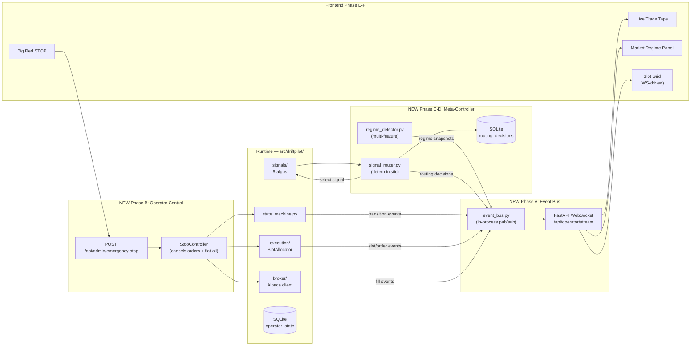
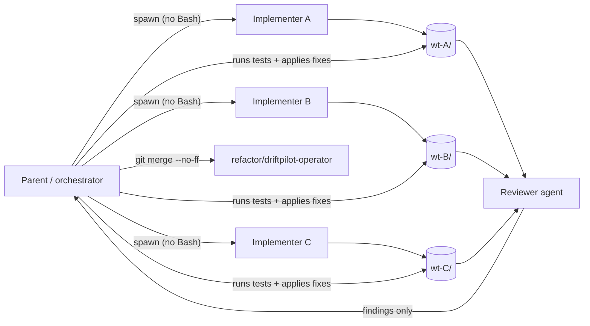

# DriftPilot Refactor Plan v2 — Live Operator Console

Status: **DRAFT** for approval. Date: 2026-05-03.

This plan addresses three operator-side gaps the read-only dashboard
exposed:

1. **Trade visibility** — operator can't see WHAT the bot is placing in
   real time. The current dashboard polls `/api/operator/state` and shows
   slots/queue, but there's no live tape of entries/exits as they happen.
2. **Emergency stop** — operator has no big-red-button to halt
   everything (cancel open orders, exit open positions, block new entries)
   when something looks wrong.
3. **Market sensing + signal routing** — current regime is SPY-only
   GREEN/CAUTION/RED. We have four diverse signals (mean reversion,
   absorption breakout, RS drift, EWMLR trend). The operator can't see
   what *kind* of market we're in and which signal is best fit, and the
   active signal is set via env var rather than driven by regime.

Plan is layered so each phase ships visible value alone. Phases A–B are
operator-immediate; C–D are the meta-controller foundation; E–F are
dashboard upgrades. Total effort: 3-5 focused engineering days.

---

## Goal: Three Visible Operator Capabilities

Quoting the user's ask verbatim:

> frontend is read only which is kind of good, but it doesn't provide
> optics into trades it is placing, live feedback is not there.
>
> stop everything button if I have to.
>
> we need to sense what kind of market it is and plug the signal. and
> that needs to be visible.

This plan adds exactly those three things, layered on top of the
existing read-only architecture without breaking it.

---

## Architecture



---

## Phase 0.5 — Type-safe `signal_state` keys  (0.5 days)

### Goal
The opaque `_OpenPosition.metadata: dict[str, Any]` design (refactor v1.1
§ 3.1) works at runtime but lets typos slip through silently — e.g.
`metadata["rachet_stage"]` returns `None` instead of raising. Each signal
should declare its own `signal_state` keys as a `TypedDict` so mypy and
runtime helpers can catch the typos.

### Backend
- New per-signal `signal_state.py` module (one per signal that uses it):
  ```python
  # signals/apex_hunter_v2/signal_state.py
  from typing import TypedDict
  class ApexHunterState(TypedDict, total=False):
      ratchet_stage: int               # 1 | 2 | 3
      current_atr_mult: float
      trailing_stop_price: float
      peak_price: float
      peak_unrealized_pct: float
      atr_at_entry: float
  ```
- Each signal's `evaluate_exit` accepts and returns the typed dict via
  `cast(ApexHunterState, position.metadata)`. Runtime payload is the
  same `dict[str, Any]` — typing only.
- New helper `signals/base.py:typed_signal_state(position, signal_state_cls)`
  that returns the TypedDict-cast view + sets reasonable defaults on
  first access.

### Acceptance
- mypy catches `metadata["rachet_stage"]` (typo) as a key error.
- Existing tests still pass — runtime behavior unchanged.
- Each of the 4 new signals has a `signal_state.py` with its own
  TypedDict declared.
- Plan v1.1 § 3.1 contract preserved: harness still treats metadata as
  opaque.

---

## Phase A — Live Trade Tape & Event Bus  (1–1.5 days)

### Goal
Every state transition / entry / exit / recycle event surfaces in real
time on the dashboard within ~100ms of happening.

### Backend
- `src/driftpilot/event_bus.py`: simple async in-process pub/sub.
  Contract: `publish(topic: str, payload: dict)` and
  `subscribe() -> AsyncIterator[Event]`. No message broker — single
  process operator. Persistence stays in SQLite as today.
- Wire publishers in:
  - `state_machine.py` — every `transition()` publishes `transition`
    event (already written to SQLite; now also broadcast).
  - `execution/slot_allocator.py` — `slot_reserved`, `slot_freed`.
  - `execution/paper_fills.py` and `broker/alpaca_client.py` — `entry_filled`,
    `exit_filled`.
  - `signals/__init__.py` (or a new scanner service) — `candidate_queue_updated`.
- New FastAPI endpoint `/api/operator/stream` (WebSocket): on
  connection, replay last N events from SQLite, then forward live
  events from the bus.

### Event schema (immutable, additive only after v1)
```python
{
    "event_id": "...",            # UUID
    "topic": "transition" | "slot_reserved" | "entry_filled" | ...,
    "timestamp_et": "2026-05-03T10:31:45-04:00",
    "symbol": "AAPL" | None,
    "slot_id": 3 | None,
    "signal": "stationary_ghost_v1" | None,
    "payload": { ... }            # topic-specific
}
```

### Storage
- New table `operator_events` (append-only). Schema:
  `event_id PK, topic, timestamp_et, symbol, slot_id, signal, payload_json, ingested_at`.
- Backend persists events on `publish()` and broadcasts on the bus.
- Retention: TTL 7 days (configurable). After 7 days, archive or drop.

### Frontend
- New `<TradeTape>` component on Operator tab.
- WebSocket subscription on mount; appends events to a virtualized list
  (auto-scroll if at bottom, freeze if user scrolled up).
- Color coding: green for `entry_filled`/`recycle`, red for
  `exit_filled` with negative P&L, blue for `transition`.
- Click an event to jump to its source row in the Admin event log.

### Acceptance
- Synthetic test: trigger 100 events in 1 second; tape renders all 100
  in correct order within 1 second.
- WS disconnect: client reconnects + replays missed events from
  `operator_events` table on reconnect.
- No event lost across a backend restart (persistence).
- Read-only — the tape is purely informational; no buttons.

---

## Phase B — Emergency Stop  (0.5 days)

### Goal
A big red button visible on every page. Click it, all activity halts
within seconds — no confirmation modal can stand between the operator
and the kill switch when it's needed.

### Backend
- New endpoint `POST /api/admin/emergency-stop` with body:
  ```json
  { "reason": "operator initiated", "operator": "karuthsanker", "idempotency_token": "..." }
  ```
- Handler in `src/driftpilot/operator_control.py`:
  1. Set `operator_state.kill_switch_armed = True` in SQLite (single
     atomic write).
  2. Cancel all open entry orders via broker (best-effort, log per-order).
  3. Submit market exits for all open positions via broker.
  4. Transition state machine to new `HALTED_OPERATOR_KILL_SWITCH` state.
  5. Publish `kill_switch_engaged` event on the bus.
  6. Return 202 immediately — broker calls happen async.
- New state in `OperatorState`: `HALTED_OPERATOR_KILL_SWITCH`.
- New endpoint `POST /api/admin/resume-from-halt` to clear the kill switch
  (REQUIRES manual confirmation — not big-red-button territory).

### Frontend
- Persistent floating red **STOP** button bottom-right of every tab.
- Single click → confirmation modal with 3-second cooldown ("hold to
  confirm" pattern is too easy to misclick; explicit confirm + countdown
  is safer).
- After confirm, button turns to "STOPPING…" with spinner; banner across
  top of every tab shows "OPERATOR KILL SWITCH ENGAGED at <time> by
  <user>"; remains until resume action.
- During HALTED_OPERATOR_KILL_SWITCH:
  - All entry-side actions disabled
  - Exits in flight allowed to complete
  - Tape still streams (so operator can watch the unwind)

### Acceptance
- From button click to first cancel-order broker call: < 500ms.
- From button click to all open positions submitted-for-exit: < 2s.
- Resume requires the explicit `/api/admin/resume-from-halt` call;
  killing the daemon and restarting does NOT auto-resume (the SQLite
  flag persists).
- Idempotency token prevents double-clicks from triggering twice.
- Audit log: every kill-switch engagement writes to a dedicated
  `operator_actions` table with operator name + timestamp + reason.

---

## Phase C — Multi-Feature Regime Detector  (1 day)

### Goal
Replace the SPY-only GREEN/CAUTION/RED scalar with a richer regime
classification driven by SPY + universe breadth + volatility +
time-of-day. The four signals each thrive in different regimes; we need
to *name* the current one explicitly.

### Backend
New module `src/driftpilot/regime_detector.py` exporting:

```python
class MarketRegime(StrEnum):
    TREND_BULL_LOW_VOL    = "trend_bull_low_vol"
    TREND_BULL_HIGH_VOL   = "trend_bull_high_vol"
    TREND_BEAR            = "trend_bear"
    RANGE_BOUND           = "range_bound"
    CHOPPY                = "choppy"
    NEWS_SHOCK            = "news_shock"
    OPENING_DRIFT         = "opening_drift"     # 9:30–10:00 ET
    CLOSING_DRIFT         = "closing_drift"     # 15:00–16:00 ET
    UNKNOWN               = "unknown"

@dataclass(frozen=True)
class RegimeSnapshot:
    timestamp_et: datetime
    regime: MarketRegime
    spy_5m_return_pct: float
    spy_15m_return_pct: float
    spy_30m_return_pct: float
    spy_atr_distance_from_vwap: float
    breadth_above_vwap_pct: float       # % of universe above VWAP
    breadth_advance_decline_ratio: float
    realized_volatility_5m: float        # annualized % stdev of SPY 1-min returns
    time_of_day_bucket: str              # "open" | "morning" | "midday" | "afternoon" | "close"
    minutes_until_close: int
    confidence_score: float              # 0-1: how clear the regime read is

def detect_regime(bar_cache, clock) -> RegimeSnapshot: ...
```

### Classification logic (deterministic, v1)
1. If `realized_volatility_5m > 2× rolling-30-day-avg` AND price moved
   >0.5% in 5 min → `NEWS_SHOCK`.
2. Else if `9:30 ≤ time_et < 10:00` → `OPENING_DRIFT`.
3. Else if `time_et >= 15:00` → `CLOSING_DRIFT`.
4. Else if `|spy_30m_return| < 0.1%` AND `breadth_above_vwap_pct ∈ [40, 60]`
   → `RANGE_BOUND`.
5. Else if `spy_30m_return > 0.3%` AND `breadth_above_vwap_pct > 65%`
   AND `realized_volatility_5m < 1× avg` → `TREND_BULL_LOW_VOL`.
6. Else if `spy_30m_return > 0.3%` AND `realized_volatility_5m > 1× avg`
   → `TREND_BULL_HIGH_VOL`.
7. Else if `spy_30m_return < -0.3%` → `TREND_BEAR`.
8. Else → `CHOPPY`.

`confidence_score` = how much the inputs cluster vs straddle thresholds.
Below 0.4 confidence, dashboard shows regime as "uncertain" rather than
the raw label.

### Storage
- New table `regime_snapshots(id, timestamp_et, regime, payload_json)`.
- One row per scanner cycle (every 30s). 7-day retention.

### Acceptance
- Synthetic SPY bars producing each regime → detector returns the
  expected `MarketRegime` value.
- `confidence_score` is between 0 and 1 across all synthetic inputs.
- Backtest-side: `replay_bars` records `regime_snapshots` so reports
  carry the regime distribution of the test period.
- Existing `signals/regime.py` kept for legacy GREEN/CAUTION/RED gates;
  new detector sits beside it.

---

## Phase D — Signal Router with three modes  (Manual now, Auto-deterministic v2, Auto-LLM v3)

### Goal
Operator picks one of three routing modes. **MANUAL is the only mode
that ships in v2.** Auto-deterministic ships when the four backtests'
`operating_envelope` blocks are populated (ETA: tonight). Auto-LLM
defers to v3.

### The three modes

```python
class RoutingMode(StrEnum):
    MANUAL              = "manual"               # v2 — ships now
    AUTO_DETERMINISTIC  = "auto_deterministic"   # v2 stretch
    AUTO_LLM            = "auto_llm"             # v3 (deferred)
```

**MANUAL** (v2 — ships now):
- Frontend dropdown lists every signal in `list_signals()` (currently 5).
- Operator selects one; backend writes `routing_mode=MANUAL` and the
  active signal name to SQLite.
- Active signal stays exactly that until operator changes it.
- This is the "I want full control" mode.

**AUTO_DETERMINISTIC** (v2 stretch — ships if Phase C's regime detector
+ tonight's reports' operating envelopes are ready):
- Router runs every 5 minutes, picks signal whose `operating_envelope`
  best matches current regime.
- 5-minute dwell time before switching (anti-thrash).
- Operator can switch to MANUAL at any time and override.

**AUTO_LLM** (v3 — placeholder, not implemented in v2):
- Frontend shows the option **disabled** with a tooltip "available in v3
  — Qwen-based market reasoning". Operator selects → toast "not
  available yet, using AUTO_DETERMINISTIC instead".
- Listed in the UI now so the eventual ship is non-disruptive (no new
  control to discover).

### Inputs (when in AUTO_DETERMINISTIC)
1. Current `RegimeSnapshot` (Phase C).
2. Each signal's `expectancy_report.json` carries an
   `operating_envelope` block (NEW — Phase D adds the field) listing
   regimes where edge_ratio was > 1.1 in that signal's backtest.
3. Operator override (a manual signal pick during AUTO mode = drop
   straight into MANUAL mode with that signal locked).
4. Last routing decision (avoid thrashing — minimum 5-minute dwell time
   before switching).

### Output
```python
@dataclass(frozen=True)
class RoutingDecision:
    timestamp_et: datetime
    routing_mode: RoutingMode        # MANUAL | AUTO_DETERMINISTIC | AUTO_LLM
    active_signal: str | None        # None = NO_SIGNAL_FITS_REGIME (auto only)
    confidence_score: float
    regime: MarketRegime
    reasoning: str                   # "Operator selected" / "Best fit for RANGE_BOUND" / etc.
    alternatives_considered: list[tuple[str, float]]   # (signal_name, score)
    operator: str | None             # set when routing_mode == MANUAL
    routing_method: str              # "manual" | "deterministic" | "llm" | "no_fit"
```

### Algorithm — AUTO_DETERMINISTIC (deterministic, no LLM)
1. Hard filters first: drop signals whose `verdict == FAIL`, drop signals
   whose `data_dependencies` aren't currently satisfied (missing SPY
   bars, etc.), drop signals outside their scan window.
2. Score remaining signals by `1.0 if regime in operating_envelope else 0.5`
   plus `0.3 * edge_ratio` (favors signals that did well historically).
3. Apply 5-minute dwell time: don't switch unless top-scored signal beats
   current by > 0.2 score margin.
4. If only one survives → pick it. If none survive → emit
   `NO_SIGNAL_FITS_REGIME` decision (active_signal=None, scanner halts
   new entries).

### Storage
- New table `routing_decisions(id, timestamp_et, active_signal,
  confidence, regime, reasoning, alternatives_json, routing_method,
  override_active)`.

### Routing Mode API
```
GET  /api/operator/routing               -> current mode + active signal + reasoning
POST /api/admin/routing/manual           { "signal": "...", "operator": "...", "reason": "..." }
POST /api/admin/routing/auto             { "operator": "...", "reason": "..." }   # AUTO_DETERMINISTIC
POST /api/admin/routing/auto-llm         { "operator": "...", "reason": "..." }   # v3, currently 501
```

### Frontend control
- Dropdown on Operator tab top strip:
  - **Manual** — submenu lists every registered signal name + version
  - **Auto (deterministic)** — picks based on regime + operating envelope
  - **Auto (LLM)** — disabled with tooltip "available in v3"
- Selection writes through the appropriate POST endpoint above.
- Currently-active option highlighted; reasoning text shown beneath
  ("Operator selected at 10:14" / "Best fit for RANGE_BOUND" / etc.).

### Acceptance
- MANUAL mode: dropdown switch from one signal to another takes effect
  on the next scanner cycle (within `SCAN_INTERVAL_SECONDS`).
- MANUAL mode: when in AUTO and operator picks a specific signal,
  routing_mode flips to MANUAL and stays there until operator
  re-selects Auto.
- AUTO_DETERMINISTIC: deterministic test fixture (synthetic regime
  stream + signal envelopes) → expected sequence of routing decisions.
- 5-minute dwell test: rapid regime flicker → router does NOT thrash.
- AUTO_LLM endpoint returns 501 Not Implemented with a clear message;
  frontend shows tooltip "available in v3".
- `NO_SIGNAL_FITS_REGIME` halts new entries but does NOT trigger the
  kill switch (existing positions exit normally).

---

## Phase E — Frontend Live Operator Console  (0.5–1 day)

### Goal
Bring all the new backend data to the screen in a way that makes
the dashboard feel like an actual trading desk rather than a polling
report.

### Changes to existing Operator tab
- Top strip:
  - **Regime indicator** (left): big colored chip with regime name +
    confidence dot (filled = high confidence, hollow = uncertain).
    Click → expand panel with the 5 input metrics.
  - **Active signal** (center): name + version + reasoning text from
    last `RoutingDecision`. Yellow border if `override_active`.
  - **STOP button** (right): permanent floating control — see Phase B.
- Slot grid: now WebSocket-driven. Slots animate state changes (color
  flash on entry/exit). Each slot shows last 3 P&L ticks as a sparkline.
- Below grid: **Live Trade Tape** (Phase A). 60% column on desktop.
  Filter chips at top: All / Entries / Exits / Errors.
- Right rail: Recent routing decisions (last 10) — useful for
  understanding "why did the bot just switch from apex to ghost".

### New "Market" panel (a fresh tab or expand-section)
- Big live SPY chart with regime-color stripes
- Breadth widget: % above VWAP, advance/decline
- Realized volatility gauge
- Time-of-day timeline annotated with regime transitions for the
  current session

### WebSocket reconnect behavior
- 1s → 2s → 5s → 10s exponential backoff
- On reconnect, fetch missed events via `GET /api/operator/events?since=<id>`
- Banner if disconnected for > 5s: "feed stale, reconnecting…"

### Acceptance
- Operator can answer "what kind of market is this and what's the bot
  doing" without refreshing the page.
- All four signal name labels appear correctly when router switches.
- Tape latency from event publish to render: < 500ms.
- Disconnected banner appears within 6s of WS drop and disappears
  within 1s of recovery.

---

## Phase G — Mid-price fill model wiring  (0.5–1 day)

### Goal
v1.1 shipped `src/driftpilot/backtest/limit_fill.py` with the corrected
placement-time-mid logic and 7 regression tests (including the
bar-derived-mid bug catcher). The module is **not yet wired into the
per-bar replay loop**, so `RS-Drift v1.1`'s `fill_rate_pct` reports as
`1.0` (every signal assumed to fill). Phase G wires it in so reports
for `ENTRY_ORDER_TYPE = "limit_mid"` signals reflect realistic fill
rates of 30–60%.

### Backend
- Extend `BacktestTrade` with two new fields (additive, default `True`
  so existing trade construction stays valid):
  - `entry_was_attempted_at_mid: bool = True`
  - `entry_was_filled: bool = True`
- In `replay_bars`, when the active signal's config declares
  `ENTRY_ORDER_TYPE == "limit_mid"`:
  - On entry-eligible cycle, instead of immediately constructing the
    open position via `_open_position`, build a `LimitOrder` with
    `placement_mid_price = (latest_bar_quote.bid + latest_bar_quote.ask) / 2`
    and `timeout_seconds = settings.entry_limit_timeout_seconds`.
  - Add the `LimitOrder` to a `pending_limits: list[LimitOrder]` queue.
  - Each tick, walk the queue: call
    `attempt_limit_fill(order, future_bars=upcoming_bars_for_symbol)`.
    On `Fill(filled=True)`, open the position. On `timeout`, record an
    "attempted but unfilled" trade row (qty=0, P&L=0, but accounted in
    `signals_attempted` for `fill_rate_pct`).
- Update `compute_locked_spec_metrics` so `signals_attempted` counts
  filled + unfilled trade rows; today it counts only filled.

### Tests
- Synthetic test: 60 bars of monotonically rising SPY (no pullback to
  placement_mid). RS-Drift run produces `fill_rate_pct == 0.0` (zero
  fills out of N signals). The current code returns 1.0; this test
  catches the regression.
- Synthetic test: 60 bars of pullback-then-rally. RS-Drift run produces
  `fill_rate_pct ∈ (0.4, 0.7)` (realistic).
- Existing `test_limit_fill.py` (7 tests) still passes — no changes to
  the module itself.
- RS-Drift verdict gate: `fill_rate_pct < 0.50` → FAIL works against
  real data not just synthetic.

### Acceptance
- After wiring, RS-Drift `expectancy_report.json` `fill_rate_pct` is
  no longer always `1.0`.
- Existing 4 backtests' results are unchanged for non-`limit_mid`
  signals.
- The 7 `test_limit_fill.py` tests pass unchanged (module API stable).
- `BacktestTrade.entry_was_filled = False` rows are filtered out of
  P&L calculations but counted in `signals_attempted`.

---

## Phase F — Documentation, ops scripts, runbook  (0.5 days)

- Update `docs/PROJECT_OVERVIEW.md` with the new component map.
- New `docs/OPERATOR_RUNBOOK.md` covering:
  - When to engage kill switch
  - How to override signal selection
  - How to interpret regime indicators
  - How to recover from `HALTED_OPERATOR_KILL_SWITCH`
- New section in `scripts/README.md` for any new ops scripts.
- Mermaid diagram in `docs/PROJECT_OVERVIEW.md` updated for new
  components.

---

## Out of scope (intentional, defer to v3)

- LLM-based routing (Qwen/Claude). Deterministic v1 first; LLM only if
  deterministic produces clear failures.
- Mobile-friendly dashboard.
- Multi-operator concurrent control (single-operator assumption).
- Audit log streaming to external SIEM.
- Automated kill-switch triggers (drawdown threshold, broker
  disconnection, etc.) — these are part of `HALTED_RISK` state and
  already exist.

---

## Hard rules (consistent with existing repo conventions)

1. Datetimes timezone-aware via `driftpilot.clock`.
2. No new dependencies without one-line justification in `pyproject.toml`.
3. Repository pattern for SQLite (no SQL strings outside repos).
4. Read-only API endpoints stay read-only; only `/api/admin/*` writes.
5. Every operator action writes a row in `operator_actions`.
6. Tests pass before phase ships.
7. Each phase is committed separately so partial rollback is possible.
8. Emergency stop is the ONLY UI control whose latency is critical;
   everything else can take 1–2s.

---

## Implementation order and effort

Sequential by dependency:

| Phase | Description | Effort | Depends on |
|---|---|---|---|
| 0.5 | Type-safe `signal_state` TypedDicts | 0.5d | — |
| A | Event bus + Live Trade Tape | 1–1.5d | — |
| B | Emergency Stop | 0.5d | — (parallel to A) |
| C | Multi-feature regime detector | 1d | — (parallel to A/B) |
| D | Signal router (3 modes; MANUAL ships in v2) | 1d | C (for AUTO); MANUAL has no deps |
| E | Frontend integration (incl. signal-mode dropdown) | 0.5–1d | A, B, C, D |
| F | Documentation | 0.5d | A–E |
| G | Mid-price fill model wiring | 0.5–1d | — (independent of A–F) |
| **Total** | | **4–6 days** | |

Parallelism map:
- Day 1: 0.5 + A + B + C + G all parallelizable (different file scopes).
- Day 2: D (depends on C). Frontend prep can begin against mock router
  data.
- Day 3: E (frontend integration). G should be wrapping up by here.
- Day 4: F (documentation, runbook).

**v2 ship priority** (highest operator value first):
1. **Phase B (Emergency Stop)** — half a day, biggest anxiety relief.
2. **Phase D MANUAL mode + signal dropdown** — half a day, gives
   operator full control without waiting on regime detector.
3. **Phase A (Live Trade Tape)** — full operator visibility.
4. **Phase 0.5 (TypedDicts)** — quiet hardening, ships in parallel.
5. **Phase G (Mid-price fill wiring)** — fixes RS-Drift `fill_rate_pct`.
6. **Phase C + D AUTO_DETERMINISTIC** — needs operating-envelope data
   from the four backtests landing tonight.
7. **Phase E + F** — wraps everything up.

Phases B + D-MANUAL + A together = ~2 days for "operator can see
everything and stop anything", which is the user's stated minimum.

---

## Acceptance for v2 complete

- Operator can engage emergency stop and see the system halt within 2s.
- Every entry/exit/transition surfaces on the live tape within 500ms.
- Operator can read the current market regime + active signal at a
  glance from the top strip.
- **Operator can pick any registered signal manually from a dropdown**
  and the bot uses that signal exclusively until told otherwise.
- AUTO_DETERMINISTIC mode switches signal automatically when regime
  changes (with 5-min dwell), and the switch reasoning is visible.
- AUTO_LLM mode is visible-but-disabled with a v3 tooltip — no new
  control to discover when LLM routing eventually ships.
- All four 2024 backtest reports' `operating_envelope` populated and
  used by the router (when running in AUTO).
- RS-Drift's `fill_rate_pct` reflects realistic mid-price fill rates
  (~30–60%) instead of the placeholder 1.0.
- `mypy` catches typos in signal_state keys (e.g. `metadata["rachet_stage"]`)
  thanks to per-signal TypedDict casts.
- Existing read-only data flow remains functional (the WebSocket
  augments rather than replaces `/api/operator/state`).

---

## Agent orchestration

Each phase is implemented in its own git worktree under
`../driftpilot-worktrees/<phase>` so multiple agents can work in
parallel without file conflicts. The pattern is:



### Agent assignment

| Wave | Phase | Worktree | Branch | Scope |
|---|---|---|---|---|
| 1 | 0.5 | `wt-typeddicts` | `v2/typeddicts` | NEW `signals/<name>/signal_state.py` (4 files) + cast in each `exits.py` |
| 1 | C | `wt-regime` | `v2/regime-detector` | NEW `regime_detector.py` + tests |
| 1 | G | `wt-midprice-wiring` | `v2/midprice-fill-wiring` | Edit `replay.py` + `metrics.py` + tests |
| 2 | B | `wt-emergency-stop` | `v2/emergency-stop` | NEW `operator_control.py` + `state_machine.py` + FastAPI + frontend STOP |
| 2 | A | `wt-event-bus` | `v2/event-bus` | NEW `event_bus.py` + WebSocket endpoint + tape frontend |
| 3 | D | `wt-router` | `v2/signal-router` | NEW `signal_router.py` + 3-mode API + dropdown |
| 4 | E | `wt-frontend-integration` | `v2/frontend-integration` | Dashboard wiring (regime panel, dropdown, tape) |
| 4 | F | `wt-docs` | `v2/docs` | `docs/` runbook + diagrams |

Wave 1 runs concurrently — no shared files. Wave 2 also concurrent.
Wave 3 starts when C is merged. Wave 4 when A/B/D are merged.

### Implementer agent rules

1. **No Bash.** Write/Edit/Read only. Parent runs tests + commits.
2. **Stay in your worktree path.** Don't read or write outside it.
3. **Reuse Phase 0 contracts** (`BlockedReason`, `Candidate`,
   `ExitDecision`, `signal_state` opaque dict). Don't redefine.
4. **Add tests.** Every new module needs at least one happy-path
   test plus one edge-case test. Tests go under `tests/` mirroring
   the source path.
5. **Commit message format:** `v2-<phase>: <module> - <change>`.
   *Implementers do not commit themselves; this is for the parent's
   final commit message.*
6. **Stop condition:** respond with the list of files written + any
   open questions. The reviewer reads from those files.

### Reviewer agent rules

1. **No Bash.** Reads worktrees, applies the code-review skill criteria
   (engineering:code-review), reports findings only.
2. **Per-worktree report** with: shipped vs spec gaps, test coverage
   gaps, type-safety issues, hard-rules compliance (timezone-aware
   datetimes, no silent except, no new deps without justification),
   one-line "ship as-is" / "ship after these fixes" / "back to
   implementer" verdict.
3. **Parent (me) acts on findings:** runs `pytest -q` against each
   worktree, applies fixes if reviewer flags them, commits with the
   `v2-<phase>:` prefix once green, then merges via `git merge --no-ff`
   into `refactor/driftpilot-operator`.
4. **Reviewer never commits or merges.**

### Why this pattern

- **Parallelism without conflicts** — worktrees physically separate file
  modifications. Conflicts only at merge, only on shared files
  (`signals/__init__.py`, `state_machine.py`).
- **Review before commit** — code never lands on the integration branch
  without a review pass. The reviewer is structurally separate from the
  implementer (no incentive to wave its own code through).
- **Parent owns the safety boundary** — `pytest`, `git`, and any
  destructive op runs only as the parent. Subagents can't accidentally
  break the integration branch even if Bash is granted.
- **Failure is bounded** — if an implementer fails (denied Bash, usage
  limit, etc.), only its worktree is affected. The other waves' work
  remains intact.

---

## Status: DRAFT

Awaiting user approval before implementation. Suggested first phase to
ship: **B (Emergency Stop)** — highest operator anxiety, lowest
implementation cost, immediate win.
