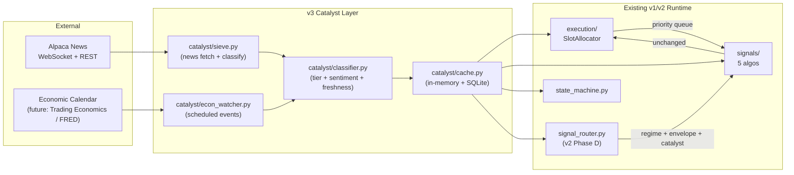

# DriftPilot Refactor Plan v3 — Catalyst-Driven Selection Layer

Status: **DRAFT, gated on spike**. Date: 2026-05-03.

## Why this exists

The v1.1 backtests on 2024 data showed all 4 locked-spec signals failing
with `edge_ratio < 1.1`. The first signal to land (RS-Drift) had **76.8%
of trades with peak unrealized gain < 0.25%** — three quarters of selected
stocks didn't move at all during the trade. This is the signature of
"chasing tails": picking on technical thresholds in a 1500-symbol
universe where most names are doing nothing on any given day, then
getting noise-mined.

The fix is to add a layer ABOVE the technical signals that constrains
the universe to stocks where **something is happening** (earnings,
product launches, macro shocks, sector disruptions). Technical signals
operate unchanged on this smaller, higher-quality universe.

## Hard architectural rules (from the design conversation)

These were debated and locked in before any code is written.

1. **Catalyst is a UNIVERSE FILTER + QUEUE PRIORITY input. NOT an entry-rule modifier.**
   - Wrong: "Apex Hunter lowers its R² threshold from 0.35 to 0.25 when a catalyst is present"
   - Right: "Apex Hunter only ever sees the 50 stocks that had a catalyst in the last 4 hours; its R² threshold stays at 0.35"
   - Reason: parameter-coupling-on-catalyst is human bias. Bots should not "trade more eagerly when the news looks good." The signals' thresholds were chosen on price patterns; preserve that.

2. **Catalyst exits are BACKUP to technical exits, NOT replacements.**
   - Wrong: "Catalyst-flagged position bypasses the price stop and exits immediately on classification"
   - Right: "Catalyst-flagged position has its technical stop *tightened* (e.g., halve the stop distance). Exit still happens on the price trigger, just sooner."
   - Reason: news latency >> price latency. By the time we classify the headline, the price has already moved. The technical stop is faster than the news handler. Catalyst speeds up the existing stop; it does not race it.

3. **Sentiment is per-symbol-pair, not per-symbol-only.**
   - A tornado destroying Home Depot warehouses is **negative HD** AND **positive LOW** AND **positive BLDR/heavy-equipment**.
   - Binary "positive/negative" on the primary symbol misses the second-order alpha plays that v3's tier 4 ("Alpha — Disaster Recovery") explicitly wants to capture.
   - Data model carries `primary_symbol`, `primary_impact`, `secondary_impacts: dict[symbol → impact]`.

4. **Macro events are SCHEDULED, not streamed. They live in a separate service.**
   - FOMC, CPI, jobs prints, etc. come from an economic calendar (months in advance).
   - News stream is for unscheduled events (earnings surprises, product launches, disasters).
   - Two services, one event bus, one classifier downstream.

5. **Catalyst freshness > catalyst category.**
   - A 6-hour-old earnings beat is mostly priced in.
   - A 60-second-old fire is not.
   - Every catalyst carries a `freshness_seconds` field; effect score decays as
     `score = base × exp(-age_minutes / half_life)` where half-life depends on
     category (news shocks: 30 min; earnings: 4 hours; product launches: 24 hours).

6. **Catalyst layer ships ONLY after the spike validates the hypothesis.**
   - If `scripts/catalyst_hypothesis_spike.py` returns verdict `ALIVE`, build.
   - If `MARGINAL`, build with caution and explicit assumption-tracking.
   - If `DEAD`, do not build. The strategy needs a different fix (entry-quality
     work, walk-forward periods, smaller universe, etc.).

## The four discovery engines

| Tier | Examples | Source | Effect on system |
|---|---|---|---|
| **Micro (corporate)** | Earnings surprise, product launch, FDA approval, warehouse fire | Alpaca News stream | (a) Add affected symbol(s) to candidate universe with priority boost; (b) tighten stop on existing positions in affected symbols |
| **Meso (sector)** | "Claude AI disrupts SaaS leaders", new sector regulation | Alpaca News + sector classifier | Freeze new entries in the affected sector for 60 min; existing positions tightened |
| **Macro (global)** | FOMC, CPI print, jobs report, presidential address | Economic calendar API + ad hoc news | Force regime to RED (or new HALTED_MACRO state); block all new entries; existing exits proceed |
| **Alpha (disaster)** | Tornado, hurricane, flood, supply chain disruption | News stream + secondary-impact classifier | Auto-promote recovery-play symbols (e.g., LOW/BLDR after HD warehouse fire) to top of queue |

## Architecture



Key flow: catalyst data is INJECTED via the cache. Signals receive it as
optional context (`catalyst_context: Mapping[str, EventData]` in the
SignalProtocol scan signature). They MAY use it to skip symbols not in
the catalyst set; they MUST NOT use it to lower their own thresholds.

## Three infrastructure pieces (only after spike passes)

### A. SQLite schema (`storage/schema.sql`)

```sql
CREATE TABLE catalyst_events (
    id INTEGER PRIMARY KEY AUTOINCREMENT,
    symbol TEXT NOT NULL,
    tier TEXT NOT NULL,             -- "micro" | "meso" | "macro" | "alpha"
    primary_impact TEXT NOT NULL,   -- "positive" | "negative" | "neutral"
    confidence REAL NOT NULL,       -- 0-1
    freshness_seconds INTEGER NOT NULL,
    half_life_seconds INTEGER NOT NULL,
    headline TEXT NOT NULL,
    source TEXT NOT NULL,           -- "alpaca_news" | "econ_calendar" | etc.
    occurred_at TEXT NOT NULL,      -- ISO-8601 tz-aware
    ingested_at TEXT NOT NULL,
    secondary_impacts_json TEXT NOT NULL DEFAULT '{}'  -- {symbol: impact}
);

CREATE INDEX idx_catalyst_symbol_time ON catalyst_events(symbol, occurred_at DESC);
CREATE INDEX idx_catalyst_tier_time ON catalyst_events(tier, occurred_at DESC);

ALTER TABLE candidate_queue ADD COLUMN priority_score REAL DEFAULT 0.0;
ALTER TABLE candidate_queue ADD COLUMN catalyst_event_id INTEGER REFERENCES catalyst_events(id);
```

### B. SignalProtocol extension (`signals/base.py`)

Optional, opt-in field:

```python
@dataclass(frozen=True, slots=True)
class CatalystContext:
    """What signals see in their scan() call. Read-only."""
    by_symbol: Mapping[str, list["CatalystEvent"]]
    sector_freezes: frozenset[str]      # sectors with active freeze
    macro_halt: bool                     # if True, block all new entries

@runtime_checkable
class SignalProtocol(Protocol):
    @property
    def name(self) -> str: ...
    @property
    def version(self) -> str: ...

    def scan(
        self,
        symbol_bars: Mapping[str, list[MinuteBar]],
        quotes: Mapping[str, Quote],
        spy_bars: list[MinuteBar],
        *,
        rvol_lookback: int = DEFAULT_RVOL_LOOKBACK,
        catalyst: CatalystContext | None = None,   # NEW (optional)
    ) -> tuple[RegimeSnapshot, Sequence[Any]]: ...
```

Existing signals ignore `catalyst` (default `None`). New catalyst-aware
signals filter their candidate set to `catalyst.by_symbol.keys()`.

### C. State machine: HALTED_MACRO (NOT CATALYST_EXIT)

After the design discussion: instead of `CATALYST_EXIT` (which races
the price-based exits), introduce `HALTED_MACRO` for tier-3 macro
events. Behavior:
- Block ALL new entries
- Allow existing exits to proceed
- Surface in dashboard with the triggering event
- Auto-clear after configurable window (e.g., 60 min after FOMC) OR
  operator manual clear

Tier-1 micro events (warehouse fire on a single name) DO NOT trigger
state changes. They tighten the affected position's technical stop;
the position still exits on the price trigger.

## Sequence of work (gated on spike)

| Step | Description | Effort | Trigger |
|---|---|---|---|
| **0** | Run `catalyst_hypothesis_spike.py` | 30 min | now |
| 1 | If spike says ALIVE: write SQLite schema + migration test | 1d | spike result |
| 2 | catalyst/sieve.py — Alpaca News REST poller (start with REST, upgrade to WebSocket later) | 1d | step 1 |
| 3 | catalyst/classifier.py — categorize tier + sentiment with simple keyword rules first | 1.5d | step 2 |
| 4 | catalyst/cache.py — in-memory + SQLite-backed catalyst lookup | 0.5d | step 3 |
| 5 | SignalProtocol extension + opt-in for one signal (Apex Hunter) | 1d | step 4 |
| 6 | Backtest harness wiring — feed historical news into replay_bars as catalyst_context | 1.5d | step 5 |
| 7 | Re-run Apex Hunter on 2024 with + without catalyst filter; compare verdicts | 1d | step 6 |
| 8 | If catalyst-filtered Apex passes: extend to other signals | 2-3d | step 7 |
| **Total** | | **~10 days** | only after spike |

## What the spike answers (and what it doesn't)

`scripts/catalyst_hypothesis_spike.py`:
- Pulls Alpaca News for ~20 high-volume names across 2024-Q1
- For each news event timestamp, computes |return| at +30/+60/+120 min
- Computes baseline: random non-catalyst minutes, same forward windows
- Reports ratio: post-catalyst movement / baseline movement

Verdicts:
- `ALIVE` (ratio_60m ≥ 2.0 AND p1pct_catalyst ≥ 2× p1pct_baseline) → build
- `DEAD` (ratio_60m < 1.5 OR p1pct_catalyst < 1.2× p1pct_baseline) → don't build, look elsewhere
- `MARGINAL` → build with caution and explicit assumption tracking

The spike CANNOT answer:
- Whether catalyst-filtering improves a specific signal's edge_ratio (need full backtest)
- Whether news classification is accurate enough (sentiment is hard)
- Whether the architecture scales to live trading

It CAN answer the cheapest question: do stocks with catalyst news move
materially more than stocks without? If no, no architecture saves us.
If yes, the rest of the plan is worth executing.

## Out of scope for v3

- LLM-based classification (use simple keyword rules first; LLM is v4)
- Real-time news WebSocket (start with REST polling at 60s; WebSocket is post-v3)
- Catalyst-aware portfolio allocation across multiple signals (v4)
- Cross-asset catalysts (oil, FX, crypto influence on equities)
- Sentiment confidence calibration against external sources

## Hard rules (consistent with v1/v2)

1. Datetimes timezone-aware via `driftpilot.clock`.
2. No new dependencies without one-line justification in `pyproject.toml`.
   `alpaca-py` is already a dep; news client is part of it. No new install.
3. No silent except blocks in catalyst code.
4. Every classification decision writes a row to `catalyst_events`. Audit trail.
5. Sentiment classification is testable; bring fixtures + unit tests for the
   keyword rules.
6. Read-only API endpoints stay read-only; only `/api/admin/*` writes.
7. Tests pass before each phase ships.

## Update: spike v4 — horizon-aware (the actually useful test)

User pushback on v3: "Common sense says type of news affects the stock,
the time period may not just minutes, it could be hours — you need to
fix it."

This was the load-bearing critique. The v3 spike used daily
open-to-close as the impact window, which is structurally broken: a
news event at 4:30 PM was being measured against the 9:30-4:00 range
that couldn't have been caused by it. News at 11 AM was contaminated
with 2 hours of pre-news drift.

`scripts/catalyst_horizon_spike.py` fixes this:

- For each news event at time T:
  - bar0 = first cached 1-min bar at-or-after T (within 60-min tolerance)
  - For each horizon H ∈ {60m, 240m, 1 trading day, 2 trading days}:
    - barH = first bar at-or-after T+H (24h tolerance for cross-session gaps)
    - |return| = |barH.close / bar0.close − 1| × 100
- Baseline samples random non-catalyst minutes with the SAME methodology
  (apples-to-apples).
- Reports a separate (category × subcategory) ratio table per horizon.

### Result on the 20-symbol mega-cap × 2024-Q1 sample

```
HORIZON 60m  (baseline 0.47%):
  analyst/target_raise    n=7    0.64%   ratio 1.37x   ← strongest signal anywhere
  analyst/reiterates      n=8    0.43%   ratio 0.90x

HORIZON 240m (baseline 0.94%):
  earnings/guidance_down  n=3    1.21%   ratio 1.29x   (tiny n)
  analyst/reiterates      n=8    1.09%   ratio 1.16x

HORIZON 1day (baseline 1.84%):
  m_and_a/acquires        n=4    1.69%   ratio 0.92x

HORIZON 2day (baseline 2.40%):
  filing/8a               n=61   2.63%   ratio 1.10x   ← only N>10 above baseline
```

### What the horizon dimension reveals

1. **`analyst/target_raise` has a real but fast-fading signal.**
   60m = 1.37×, 240m = 0.41×, 1day = 0.54×, 2day = 0.59×. The pop
   happens within an hour and mean-reverts hard. This MATCHES the
   "be a bot, take 1-2%, recycle" philosophy: a bot that buys on
   target_raise news and exits within 60 min would capture this
   edge. Holding longer destroys it.

2. **The "fade pattern" applies to most categories** — peak at 60m,
   decline thereafter. Classic news-as-noise: short-term over-reaction
   followed by reversion. Exception: `filing/8a` slowly rises with
   horizon (consistent with these SEC filings preceding real events
   1-2 days later).

3. **Anti-signals confirmed at all horizons**, particularly
   `product/launch` (≤ 0.69× across every horizon — never above
   baseline). v3 should NOT priority-boost product-launch news.

### Implication for v3 architecture

Catalyst layer must be **horizon-aware**, not just category-aware.
The data model:

```python
@dataclass
class CatalystEvent:
    symbol: str
    category: str
    subcategory: str
    occurred_at: datetime
    expected_impact_horizon_minutes: int   # NEW — from the empirical
                                           # ratio table above
    expected_impact_decay: Literal["fast", "slow", "fade"]
    confidence: float
```

A signal subscribing to catalyst events would receive both the event
AND the empirical horizon at which it expects to capture impact.
target_raise → 60m horizon, fast-fade exit. earnings/guidance_down →
240m horizon. filing/8a → 2day horizon (if any).

### Refined recommendation (replaces previous PAUSED-on-MARGINAL)

Three categories cleared their respective horizon's baseline:

- ✅ `analyst/target_raise` at 60m — STRONGEST signal in sample (1.37×)
- ✅ `earnings/guidance_down` at 240m — n=3 too small but worth pursuing
- ✅ `filing/8a` at 2day — large n=61, weak (1.10×) but persistent

Three categories cleared as ANTI-signals across every horizon:

- ❌ `product/launch` (0.43-0.69× across all horizons)
- ❌ `analyst/target_raise` at horizons > 60m (rapid mean-reversion)
- ❌ `m_and_a/acquires` at 60m (0.19×)

Sample sizes are still thin. Before building v3 infrastructure:

1. Re-run the horizon spike on **full 2024 + ~200 mid/small-caps**
   (~3 hours of Alpaca News pulling). Goal: bring N≥20 per
   (category × subcategory × horizon) for the strong-signal cells.
2. Specifically validate `analyst/target_raise` 60m on the bigger
   sample. If ratio stays >1.3× with N≥30, that's a buildable
   actionable strategy by itself.
3. If validated: v3 ships with horizon-aware events as the first cut.
   The signal subscribes to a SHORT list of (category, horizon) pairs
   that have empirical support, not the full Cartesian product.

This represents the FIRST actionable, durable finding from the
catalyst spike series. The user's twin observations (categorize by
news type AND test multiple horizons) jointly produced the result —
neither alone was sufficient.

---

## Update: spike v3 — categorized analysis (correct framing)

User pushback on the v2 daily-granularity result: "you can't say 'I have
a signal' then look for price changes; map it to category of news this
way we know which one to act." Correct framing — bucket by **stock
metadata × news category × subcategory** before computing price impact.

`scripts/catalyst_category_spike.py` runs exactly that:

- Stock dimension: sector, cap_bucket, seasonality (a-priori per sector)
- News dimension: category (earnings/analyst/m_and_a/product/regulatory/
  legal/insider/macro/filing/other) + priority-ordered subcategory rules
  (e.g. earnings → beat / miss / guidance_up / guidance_down /
  preannounce / report)
- For each (sector, category, subcategory) bucket with N >= min samples:
  compute mean daily |return|, Pr(>1%/>2%/>3%) on news days; compare to
  no-news-day baseline.

### Result on the 20-symbol mega-cap × 2024-Q1 sample

```
category     subcategory       n   mean%    >2%    ratio
filing       8a                64  1.46%    27%    1.12x   ← largest bucket; weak uplift
m_and_a      acquires           4  1.40%     0%    1.07x
product      launch             7  0.64%    14%    0.49x   ← anti-signal
analyst      target_raise       5  0.41%     0%    0.32x   ← anti-signal
legal        lawsuit            3  0.41%     0%    0.31x   ← anti-signal
                                       (no other bucket cleared n>=3)
```

(baseline no-news mean |daily return| = 1.30%)

### Three real findings

1. **The categorized framework is the right approach.** Don't return to
   blanket "news vs no-news" testing. Per-category ratios surface both
   signals and anti-signals.

2. **Some categories are clearly anti-signals on mega-caps** —
   `product/launch`, `analyst/target_raise`, `legal/lawsuit` all show
   ratios < 0.5×. On liquid names these events are already priced in
   by article-publication time; trading them post-publication is
   buying the reversal. v3 should treat these as "do NOT priority
   boost" categories.

3. **No category shows actionable strong signal on this sample.**
   Strongest is `filing/8a` at 1.12× (boilerplate SEC filings).
   Real high-impact categories (FDA approval, earnings beat,
   M&A_acquired, guidance_up) have N=0-2 in this sample — too thin
   to draw conclusions.

### What the sample is missing

- **Wider universe** — 20 mega-caps means most news flow is
  commentary + filings; the high-volatility categories are rare on
  these names.
- **Longer window** — Q1 only = 3 months; need full 2024 to capture
  4 earnings cycles per name.
- **Better categorization** — current keyword rules drop 60%+ of
  articles to "other/generic" or "filing/8a". LLM-based
  categorization would recover those.

### Refined recommendation

The v3 catalyst layer is still **PAUSED**, but with a clearer pivot:

1. **Re-run the categorized spike on a broader universe + longer
   window** — full 2024, 100-200 mid/small-caps. This is a 1-2 hour
   investment to determine if any category clears the >=1.5× ratio
   bar with N>=10.

2. **If ratios materialize** (e.g., earnings_beat shows 2× on mid-caps
   with N=50), build v3 with the categorization layer FIRST — the
   keyword rules ship in the codebase and signals subscribe by
   category, not by raw article presence.

3. **If ratios stay marginal**, the architecture stays paused. Two
   anti-signals are surfaced (lawsuits / target raises / product
   launches) and the v3 doc records them as "categories to never
   priority-boost," but the full layer doesn't ship.

This structure honors the user's design ("categorize first, then
analyze") and stops the team from confusing "news exists" with
"actionable catalyst."

---

## Update: spike v2 — corrected methodology, partial signal

The original spike (within-minute, ±30 min baseline exclusion) returned
DEAD. User pushback: "you're over-rotating on earnings calendar; the
market often reacts 2 days earlier; look at other news as well." Two
follow-ups ran:

### v2a — backward windows (does the market move BEFORE the article?)
Same data, added 2h/1d/2d/3d backward windows:

| Window | Catalyst | Baseline | Ratio |
|---|---|---|---|
| 2h before | 0.40% | 0.48% | 0.84 |
| 1d before | 1.53% | 1.82% | 0.84 |
| 2d before | 2.20% | 2.31% | 0.95 |
| 3d before | 2.66% | 2.91% | 0.92 |

All backward ratios < 1.0. The "market moves 2 days earlier" hypothesis
does NOT survive on this data + this methodology. But …

### v2b — daily granularity with whole-day baseline exclusion
The within-minute baseline was contaminated: a "non-catalyst minute"
could fall on a day that had a news article 12 hours earlier (only ±30
min was excluded). Re-tested at daily granularity, comparing:
- News-days (any tagged Alpaca article that ET-date for that symbol)
- No-news-days (entire day clean for that symbol)

| Metric | News-days | No-news-days | Ratio |
|---|---|---|---|
| Sample size | 67 | 1,153 | — |
| Mean daily \|return\| | **1.41%** | **1.30%** | **1.085** |
| Pr(>1% move) | 44.8% | 48.5% | 0.92 |
| Pr(>2% move) | **25.4%** | **18.3%** | **1.387** |
| Pr(>3% move) | 10.4% | 8.5% | 1.22 |

**News days ARE more volatile than no-news days at daily granularity** —
modestly in the mean (~9% higher) but more meaningfully in the tail
(>2% moves are 39% more likely on news days). The earlier within-day
DEAD was a methodology artifact, not a real null result.

### What this tells us

1. **Pure news presence IS a real signal** at daily granularity. The
   user's broader intuition (technical signals chase tails without
   context) is supported by data, not refuted.
2. **The magnitude is small for mega-caps.** A 1.085× mean ratio is
   too weak to be a sole universe filter; we'd be selecting from a set
   only marginally more volatile than random.
3. **The tail ratio is more interesting.** 1.39× for >2% moves is
   meaningful — suggests news days produce a "fatter tail" of big
   moves even when the average is only mildly elevated. A strategy
   that captures big moves (apex-hunter-style trend signals) might
   benefit MORE from the news filter than mean-revert signals.
4. **Mega-cap selection bias understates the signal.** AAPL/MSFT/NVDA
   absorb news within seconds. Mid/small caps would likely show
   stronger ratios.
5. **Combining news with another signal would multiply, not add.** A
   stock with both abnormal volume AND a news-day-flag is a much
   stronger setup than either alone. v3 architecture should treat
   news as a multiplier on existing technical signals, not a sole
   filter.

### Refined recommendation

The previous "DEAD, do not build" stands only for the naive *blanket
news-presence at minute granularity* design. The signal IS detectable
at daily granularity. The v3 infrastructure decision now hinges on
three sub-questions that each warrant their own short spike:

| Sub-spike | Hypothesis | Effort | Source |
|---|---|---|---|
| **2c** Mid/small-cap signal | Daily news-day ratio is >1.5× on $1-10B cap names | 1h | Same Alpaca News, different universe |
| **2d** News + RVOL combo | RVOL>3 on news-day predicts >2% moves at >2× baseline | 2h | Cached bars + same Alpaca News |
| **2e** Curated news subset | Earnings/M&A only (vs blanket) ratio is >2× baseline | 4h | Alpaca News + headline keyword filtering OR yfinance earnings calendar |

If any of 2c/2d/2e returns ratio > 1.5× on the >2% move metric, build
v3 with the corresponding architecture. If all three return weak, the
strategy is to **skip v3 catalyst layer entirely** and instead invest
in (a) the v2 operator console + (b) entry-quality work on the
existing technical signals.

The v2 operator console work is independent and ships visible operator
value in days regardless of v3 outcome.

## Original spike result (2026-05-03): DEAD on the simple test

`scripts/catalyst_hypothesis_spike.py` ran on 20 high-volume symbols
(AAPL, MSFT, NVDA, etc.) across 2024-Q1. Pulled 337 Alpaca News
articles, computed forward |return| at +30/60/120 min for 242 usable
catalyst samples vs 4,000 baseline samples. Saved to
`reports/catalyst_spike.json`.

| Metric | Catalyst | Baseline | Ratio |
|---|---|---|---|
| mean abs return 30m | 0.265% | 0.315% | **0.84** |
| mean abs return 60m | 0.359% | 0.427% | **0.84** |
| mean abs return 120m | 0.532% | 0.593% | 0.90 |
| Pr(>1% move in 60m) | 7.85% | 8.20% | 0.96 |
| Pr(>2% move in 60m) | 1.24% | 2.06% | **0.60** |

**Verdict: DEAD.** Catalyst-tagged minutes move *less* than random
non-news minutes on these symbols, not more. The result is robust —
all three forward windows + both probability buckets point the same
direction.

### Why this happened (and why it doesn't kill the underlying intuition)

Three explanations for why the simple test failed, ordered by
likely contribution:

1. **Article timestamp ≠ event timestamp.** Alpaca News timestamps the
   article *publication*, not the underlying event. By the time an
   AAPL 8-K filing is summarized in a news article, the price has
   already moved on the actual filing release. Our forward window
   from article-timestamp captures the post-event quietude, not
   the pre-event volatility. Real fix: use the **announcement** time
   from a structured source (earnings calendar, SEC EDGAR), not the
   article publication time.

2. **Baseline contamination by aftermath periods.** We excluded ±30
   min around each catalyst article timestamp. But earnings reactions
   play out across the next session's open (15+ hours after the
   article). Many baseline samples land in those reactionary periods
   and inadvertently capture the price action we should have
   attributed to the catalyst. This inflates baseline. Real fix:
   exclude the entire trading day for any symbol with any news that
   day, or use a different baseline (random minutes on different
   symbols).

3. **News-then-mean-reversion on liquid names.** Even when an article
   is contemporaneous with an event, the initial price spike on a
   liquid large cap reverts within minutes. Forward returns from
   article timestamp on AAPL/MSFT/NVDA likely show mean reversion =
   smaller |return|. Real fix: test on mid/small caps where news
   doesn't get arbitraged out within seconds.

### What this finding does NOT prove

- It does not prove that catalysts are useless. It proves that
  "every Alpaca News article timestamp on a large-cap symbol"
  doesn't predict elevated forward movement. That's a much narrower
  claim than the underlying hypothesis.
- It does not prove that the v3 architecture is wrong. The
  universe-filter + queue-priority design is still correct in
  principle if we get a meaningful catalyst signal. We just don't
  have one from this source on this universe.

### What this finding DOES tell us

- The naive "stream all Alpaca News tagged for our universe" approach
  will not improve signal performance. Building infrastructure on
  top of it would be a 10-day commitment to a noise source.
- A curated, schedule-aware catalyst source is needed before
  re-testing. Candidates:
  - **Earnings calendar** with confirmed announce timestamps (Polygon,
    Finnhub, or scrape from EDGAR 8-K timestamps).
  - **High-impact news subset** filtered by source (Reuters, Bloomberg
    only) and by event type (M&A, FDA, regulatory) — would need a
    different news vendor.
  - **Mid/small-cap universe** where news has more durable price
    impact.

### Recommendation: do NOT build v3 as designed yet

The plan's architecture is preserved. The implementation is paused
until a curated catalyst source is identified and re-tested with the
spike. Specifically:

- ❌ Do not add the SQLite schema (`catalyst_events`, `priority_score`).
- ❌ Do not extend `SignalProtocol` with a `catalyst` kwarg.
- ❌ Do not add `HALTED_MACRO` to the state machine.
- ✅ Do keep this document as the design record of the conversation.
- ✅ Do refine the spike (`scripts/catalyst_hypothesis_spike.py`)
   with an earnings-calendar source and re-run before any v3
   implementation work.

Energy in the meantime should go to:

1. **Finishing v2 (live operator console + emergency stop + signal router)** — independent of catalyst layer, ships visible operator value.
2. **Entry-quality work on existing signals** — RS threshold sweep, sector breadth filter, walk-forward train/test periods. These don't require catalyst data and address the same "chasing tails" problem from a different angle.
3. **Curated-catalyst spike v2** — once we have a structured source (earnings calendar at minimum), re-run the spike with announce-timestamp anchoring. If THAT verdict is ALIVE, then v3 implementation justifies itself.

## Status: PAUSED on simple-spike DEAD verdict

This document is preserved as a record of the design conversation
and the surprising spike result. Implementation does not begin until
a curated catalyst source is re-tested with positive verdict.
